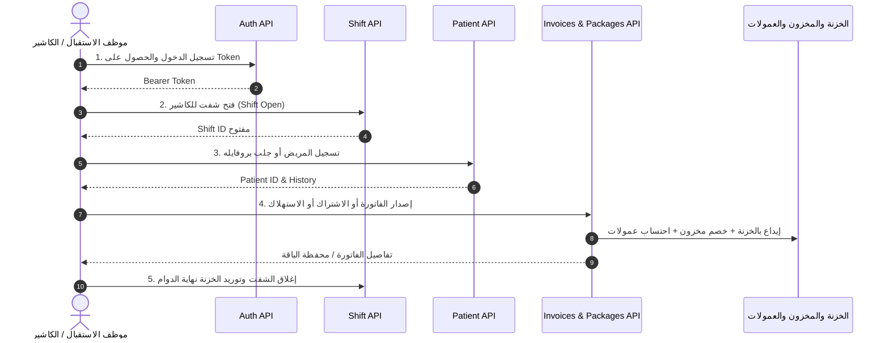

# الدليل الشامل لـ APIs الفواتير والباقات والعروض (Invoices & Packages API Guide)

دليل مرجعي شامل ومفصل لجميع الـ Endpoints الخاصة بإصدار الفواتير، بيع واستهلاك الباقات، سداد المديونيات، وحركات الخزنة والمخزون في **نظام إدارة العيادات والمراكز الطبية (Clinic System ERP)**.

---

## 📌 أولاً: تسلسل استدعاء الـ APIs بالترتيب المنطقي (Standard Flow)

لضمان عمل النظام المالي والمخزني بدون أخطاء، يجب أن تسير نداءات الـ APIs وفق هذا الترتيب:



### الخطوات بالتفصيل:
1. **تسجيل الدخول (`POST /api/v1/auth/login`)**:
   - إرسال الإيميل وكلمة المرور للحصول على `access_token` مع إضافة `Authorization: Bearer {token}` في كل الطلبات التالية.
2. **التحقق من الشفت وفتحه (`POST /api/v1/shifts/open`)**:
   - **شرط إلزامي**: النظام يمنع إنشاء أي فاتورة أو تحصيل مالي إذا لم يكن للكاشير شفت مفتوح حالياً.
3. **تحديد أو إنشاء المريض (`GET /api/v1/patients` أو `POST /api/v1/patients`)**:
   - للحصول على `patient_id`.
4. **تنفيذ العملية المطلوبة (إصدار فاتورة / بيع باقة / استهلاك / سداد متبقي)**:
   - استدعاء الـ Endpoint المناسب للعملية.
5. **متابعة ملف المريض ومحفظة الباقات (`GET /api/v1/patients/{id}/profile`)**:
   - يوضح كشف حساب المريض، الرصيد المتبقي للباقات، وسجل الجلسات.
6. **إغلاق الشفت (`POST /api/v1/shifts/{id}/close`)**:
   - في نهاية دوام الكاشير لحساب إجمالي العجز والزيادة وتوريد الخزنة الرئيسية.

---

## 📌 ثانياً: جدول الـ Endpoints المستخدمة في الفواتير والباقات

| # | العملية | الـ Method | الـ Endpoint | الوصف |
|---|---|:---:|---|---|
| **1** | فتح شفت كاشير | `POST` | `/api/v1/shifts/open` | فتح درج الخزنة للكاشير لبدء إصدار الفواتير |
| **2** | إغلاق شفت كاشير | `POST` | `/api/v1/shifts/{id}/close` | تقفيل الشفت وتوريد النقدية |
| **3** | إنشاء فاتورة جديدة | `POST` | `/api/v1/invoices` | الفاتورة الموحدة (جلسات، منتجات، عروض، استهلاك) |
| **4** | عرض فواتير النظام | `GET` | `/api/v1/invoices` | فلترة وعرض الفواتير بالتواريخ والمرضى والأطباء |
| **5** | تفاصيل فاتورة محددة | `GET` | `/api/v1/invoices/{id}` | عرض البنود، المدفوع، المتبقي، والمعاملات |
| **6** | سداد متبقي فاتورة | `POST` | `/api/v1/invoices/{id}/pay` | سداد دفعة نقدية/فيزا لفاتورة عليها متبقي |
| **7** | استرداد فاتورة | `POST` | `/api/v1/invoices/{id}/refund` | استرداد كلي أو جزئي وإرجاع المخزون |
| **8** | اشتراك في باقة / عرض | `POST` | `/api/v1/patient-packages/subscribe` | شراء كورس/عرض وتوليد محفظة أرصدة |
| **9** | استهلاك جلسة من باقة | `POST` | `/api/v1/patient-packages/consume` | خصم جلسة وتوليد فاتورة بصافي 0 ج وحساب عمولة الطبيب |
| **10** | سداد متبقي / قسط باقة | `POST` | `/api/v1/patient-packages/{id}/pay-debt` | سداد جزء من مديونية باقة مؤجلة |
| **11** | باقات المريض المتاحة للاستهلاك | `GET` | `/api/v1/patients/{patient_id}/active-packages` | الباقات النشطة التي يملك المريض رصيداً بها |
| **12** | بروفايل المريض الشامل | `GET` | `/api/v1/patients/{id}/profile` | كل الفواتير، الباقات، الأرصدة، الجلسات، والمديونيات |

---

## 📌 ثالثاً: تفاصيل الحالات وشكل الـ Request Body والـ Response

---

### الحالة 1: شراء منتج أو أدوية عادية (Product / Medication Sale)

تُستخدم عند شراء المريض مستلزمات طبية، كريمات، أو أدوية من الاستقبال.

- **الرابط**: `POST /api/v1/invoices`
- **Headers**:
  ```http
  Authorization: Bearer {token}
  Content-Type: application/json
  Accept: application/json
  ```
- **Request Body**:
```json
{
  "patient_id": 1,
  "type": "product_sale",
  "payment_method": "cash",
  "paid_amount": 350.00,
  "discount": 0,
  "notes": "شراء واقي شمس وكريم مرطب",
  "items": [
    {
      "item_type": "product",
      "product_id": 4,
      "quantity": 2
    },
    {
      "item_type": "product",
      "product_id": 7,
      "quantity": 1
    }
  ]
}
```
- **ما يحدث تلقائياً بالسيستم**:
  1. خصم الكميات فوراً من المخزن (`current_stock`).
  2. تسجيل حركة إيراد في الخزنة للشفت الحالي (`Transaction: INCOME`).
  3. احتساب عمولة التمريض من بيع الأدوية آلياً وفق عقد الممرض (نسبة أو قيمة لكل قطعة).
- **Response المرجع (Status: 201 Created)**:
```json
{
  "status": true,
  "message": "تم إنشاء الفاتورة بنجاح.",
  "data": {
    "id": 105,
    "invoice_number": "INV-2026-000105",
    "type": "product_sale",
    "subtotal": 350.0,
    "discount": 0.0,
    "tax": 0.0,
    "grand_total": 350.0,
    "paid_amount": 350.0,
    "remaining_amount": 0.0,
    "status": "paid",
    "payment_method": "cash",
    "items": [
      {
        "id": 210,
        "item_type": "product",
        "item_name": "واقي شمس لاروش",
        "unit_price": 125.0,
        "quantity": 2,
        "total_price": 250.0
      },
      {
        "id": 211,
        "item_type": "product",
        "item_name": "سيروم فيتامين سي",
        "unit_price": 100.0,
        "quantity": 1,
        "total_price": 100.0
      }
    ]
  }
}
```

---

### الحالة 2: شراء / تنفيذ جلسة خدمة طبية عادية (Service / Consultation Session)

تُستخدم عند حضور مريض لكشف طبي أو جلسة علاجية مباشرة مع الطبيب.

- **الرابط**: `POST /api/v1/invoices`
- **Request Body**:
```json
{
  "patient_id": 1,
  "appointment_id": 15,
  "type": "session",
  "doctor_id": 3,
  "payment_method": "visa",
  "paid_amount": 600.00,
  "discount": 50.00,
  "notes": "جلسة فراكشنال ليزر للوجه",
  "items": [
    {
      "item_type": "service",
      "service_id": 12,
      "quantity": 1,
      "service_items_ids": [101, 104]
    }
  ]
}
```
> **ملاحظة**: `service_items_ids` اختيارية لتحديد مستلزمات طبية معينة تم استهلاكها أثناء الجلسة ليتم خصمها من المخزن.

- **ما يحدث تلقائياً بالسيستم**:
  1. خصم المواد المستهلكة المربوطة بالخدمة من المخزن.
  2. إيداع المبلغ (600 ج) في خزنة شفت الكاشير بطريقة `visa`.
  3. ربط الجلسة بالطبيب وحساب عمولته وفق عقده وسعر أساس الخدمة (`doctor_service_price`).
  4. احتساب تقدم الطبيب نحو كسر التارجت الشهري.

---

### الحالة 3: تنفيذ جلسة جهاز مع ممرض/ممرضة (Device Session with Nurse)

تُستخدم لجلسات أجهزة العناية والتنظيف والتنحيف التي يشرف عليها طبيب وينفذها ممرض (مثل: الهيدرافيشل، الهايفو، الكافيتيشن).

- **الرابط**: `POST /api/v1/invoices`
- **Request Body**:
```json
{
  "patient_id": 1,
  "type": "session",
  "doctor_id": 3,
  "nurse_id": 8,
  "payment_method": "cash",
  "paid_amount": 450.00,
  "items": [
    {
      "item_type": "service",
      "service_id": 18,
      "quantity": 1
    }
  ],
  "notes": "جلسة تنظيف هيدرافيشل عميق مع الميس"
}
```
- **ما يحدث تلقائياً بالسيستم**:
  1. تحديد الخدمة كخدمة جهاز (`type = device`).
  2. حساب عمولة جلسة الجهاز للممرض المحدد `nurse_id: 8` (مثلاً: 10 ج للجلسة المحددة بعقده).
  3. حساب عمولة الطبيب المشرف `doctor_id: 3`.

---

### الحالة 4: شراء باكدج / عرض وسداد كلي أو جزئي (Subscribe to Package / Offer)

تُستخدم عند اشتراك المريض في كورس أو عرض (مثال: عرض 5 جلسات ليزر + 1 حقنة فيلر).

#### الطريقة الموصى بها (Dedicated Endpoint):
- **الرابط**: `POST /api/v1/patient-packages/subscribe`
- **Request Body (سداد جزئي مع مديونية متبقية)**:
```json
{
  "patient_id": 1,
  "package_id": 2,
  "payment_method": "cash",
  "paid_amount": 1000.00,
  "doctor_id": 3,
  "notes": "اشتراك عرض الصيف (سعر العرض 2500 ج، دفع 1000 ج والباقي 1500 ج)"
}
```
- **ما يحدث تلقائياً بالسيستم**:
  1. إنشاء فاتورة مبيعات باقة `package_sale` بقيمة `grand_total = 2500 ج`، ومدفوع `1000 ج`، ومتبقي `1500 ج`.
  2. إيداع الـ 1000 ج في خزنة الشفت كحركة دخل.
  3. إنشاء سجل اشتراك المريض في الباقة (`patient_packages`) بمديونية متبقية `1500 ج`.
  4. توليد **محفظة أرصدة الجلسات والمواد** للمريض (`patient_package_balances`) بكامل الرصيد (مثلاً: 5 جلسات ليزر + 1 حقنة فيلر).
  5. **عدم خصم المخزن نهائياً في هذه المرحلة** (لأن المواد لم تُحقن بعد).
- **Response المرجع (Status: 201 Created)**:
```json
{
  "status": true,
  "message": "تم الاشتراك في العرض وإصدار الفاتورة وتوليد محفظة الأرصدة بنجاح.",
  "data": {
    "id": 14,
    "patient_id": 1,
    "patient_name": "أحمد محمود",
    "package_id": 2,
    "package_name": "عرض العناية والنضارة الملكي",
    "package_type": "mixed",
    "invoice_number": "INV-2026-000108",
    "total_price": 2500.0,
    "paid_amount": 1000.0,
    "remaining_amount": 1500.0,
    "is_fully_paid": false,
    "status": "active",
    "status_label": "نشط",
    "balances": [
      {
        "id": 31,
        "item_type": "service",
        "item_type_label": "جلسة خدمة",
        "display_name": "ليزر كربوني للوجه",
        "total_quantity": 5.0,
        "consumed_quantity": 0.0,
        "remaining_quantity": 5.0,
        "unit": "جلسة",
        "is_exhausted": false
      },
      {
        "id": 32,
        "item_type": "product",
        "item_type_label": "مادة مخزنية / حقن",
        "display_name": "أمبول نضارة ميزوثيرابي",
        "total_quantity": 2.0,
        "consumed_quantity": 0.0,
        "remaining_quantity": 2.0,
        "unit": "أمبول",
        "is_exhausted": false
      }
    ]
  }
}
```

---

### الحالة 5: استهلاك جلسة من باكدج (Consume Package Session - الفاتورة الصفرية)

تُستخدم عندما يحضر المريض بعد أسبوع لتنفيذ جلسة من رصيده السابق.

- **الرابط**: `POST /api/v1/patient-packages/consume`
- **Request Body**:
```json
{
  "patient_package_balance_id": 31,
  "quantity": 1,
  "doctor_id": 3,
  "nurse_id": 8,
  "appointment_id": 24,
  "notes": "استهلاك الجلسة الأولى ليزر كربوني من عرض النضارة"
}
```
- **ما يحدث تلقائياً بالسيستم**:
  1. خصم `1` جلسة من رصيد البند المتبقي في محفظة المريض ليصبح المتبقي `4`.
  2. إنشاء **فاتورة بصافي 0.00 ج.م** (`unit_price = 0` و `paid_amount = 0`) حتى لا يدفع المريض شيئاً ولا يحدث تكرار إيراد في الخزنة.
  3. إذا كان البند المستهلك مستلزماً/حقناً (`product_id`)، يتم فوراً خصم الكمية المستهلكة من رصيد الصيدلية/المخزن الفعلي.
  4. تسجيل دور الطبيب `doctor_id: 3` واحتساب عمولته بناءً على سعر الأساس المعتمد بعقده (`doctor_service_price`) وحساب عمولة الممرض.
  5. إذا استهلك المريض آخر جلسة في الباقة، تتحول حالة الباقة تلقائياً إلى مكتملة ومستهلكة بالكامل (`completed`).

---

### الحالة 6: سداد متبقي / قسط من باكدج (Pay Package Debt / Installment)

تُستخدم عندما يحضر المريض لدفع جزء من المديونية المتبقية عليه من ثمن الباقة.

- **الرابط**: `POST /api/v1/patient-packages/{patient_package_id}/pay-debt`
- **Request Body**:
```json
{
  "amount": 500.00,
  "payment_method": "cash",
  "notes": "سداد القسط الثاني من عرض الصيف"
}
```
- **ما يحدث تلقائياً بالسيستم**:
  1. خصم الـ 500 ج من مديونية الباقة ليصبح المتبقي `1000 ج` بدلاً من `1500 ج`.
  2. زيادة المبلغ المسدد للباقة `paid_amount` إلى `1500 ج`.
  3. إنشاء فاتورة تحصيل قسط وإيداع الـ 500 ج كدخل نقدي في شفت الكاشير المفتوح.
  4. إذا سدد المريض كامل المبلغ المتبقي، تُصبح الباقة مسددة بالكامل (`is_fully_paid = true`).

---

### الحالة 7: سداد متبقي لفاتورة عادية (Pay Remaining of Regular Invoice)

تُستخدم عندما يكون على فاتورة كشف أو جلسة عادية مبلغ آجل وجاء المريض لتسديده.

- **الرابط**: `POST /api/v1/invoices/{invoice_id}/pay`
- **Request Body**:
```json
{
  "amount": 200.00,
  "payment_method": "visa"
}
```
- **ما يحدث تلقائياً بالسيستم**:
  1. تحديث `paid_amount` للفاتورة وتخفيض `remaining_amount`.
  2. إذا أصبح المتبقي 0 ج، تتغير حالة الفاتورة تلقائياً إلى مدفوعة بالكامل (`paid`).
  3. تسجيل حركة إيراد جديدة برقم الفاتورة في الشفت الحالي.

---

### الحالة 8: استرداد فاتورة (Refund Invoice - كلي أو جزئي)

تُستخدم في حال إلغاء الخدمة أو رغبة المريض في استرداد نقوده.

- **الرابط**: `POST /api/v1/invoices/{invoice_id}/refund`
- **Request Body**:
```json
{
  "items": [
    {
      "invoice_item_id": 210,
      "quantity": 1
    }
  ],
  "notes": "استرداد عبوة واقي شمس غير مستخدمة"
}
```
- **ما يحدث تلقائياً بالسيستم**:
  1. خصم المبلغ المسترد من خزنة الشفت كحركة منصرف (`Transaction: REFUND`).
  2. إعادة كمية الصنف المسترد تلقائياً إلى رصيد المخزن (`current_stock`).
  3. تحديث قيمة `refunded_amount` وحالة الفاتورة إلى مستردة (`refunded` أو `partially_refunded`).

---

## 📌 رابعاً: الاستعلام والتحقق من حساب المريض الشامل (Patient Profile)

لمعرفة كل ما يخص المريض بعد تنفيذ العمليات السابقة (كم دفع، كم متبقي، رصيد باقاته، وسجل الجلسات):

- **الرابط**: `GET /api/v1/patients/{id}/profile`
- **مثال على الـ Response الشامل**:
```json
{
  "status": true,
  "message": "Patient profile retrieved successfully",
  "data": {
    "patient_info": {
      "id": 1,
      "name": "أحمد محمود",
      "phone": "01012345678",
      "gender": "male",
      "gender_arabic": "ذكر",
      "age": 29
    },
    "financial_summary": {
      "account_status": "has_debt",
      "account_status_arabic": "عليه مديونية قدرها 1000 ج.م",
      "total_invoices_count": 4,
      "total_billed_amount": 3450.0,
      "total_paid_amount": 2450.0,
      "total_remaining_amount": 1000.0,
      "total_packages_debt": 1000.0,
      "payment_methods_summary": {
        "cash": 1850.0,
        "visa": 600.0,
        "wallet": 0.0,
        "insurance": 0.0
      }
    },
    "packages_summary": {
      "total_packages_count": 1,
      "active_packages_count": 1,
      "completed_packages_count": 0,
      "expired_packages_count": 0,
      "total_packages_billed": 2500.0,
      "total_packages_paid": 1500.0,
      "total_packages_remaining_debt": 1000.0,
      "active_remaining_sessions_count": 4.0,
      "active_remaining_products_count": 2.0
    },
    "purchased_packages": [
      {
        "id": 14,
        "package_name": "عرض العناية والنضارة الملكي",
        "package_type_label": "باقة منوعة",
        "status_label": "نشط وساري",
        "total_price": 2500.0,
        "paid_amount": 1500.0,
        "remaining_amount": 1000.0,
        "is_fully_paid": false,
        "balances": [
          {
            "display_name": "ليزر كربوني للوجه",
            "total_quantity": 5.0,
            "consumed_quantity": 1.0,
            "remaining_quantity": 4.0,
            "consumption_percentage": 20.0,
            "is_exhausted": false
          }
        ],
        "consumptions": [
          {
            "item_name": "ليزر كربوني للوجه",
            "consumed_quantity": 1.0,
            "doctor_name": "د. هبة الشريف",
            "nurse_name": "ميس منى",
            "consumed_at": "2026-09-27 12:30"
          }
        ]
      }
    ]
  }
}
```

---
تم إعداد هذا التوثيق ليتطابق بدقة 100% مع البنية البرمجية وقواعد العمل المعتمدة في النظام.
