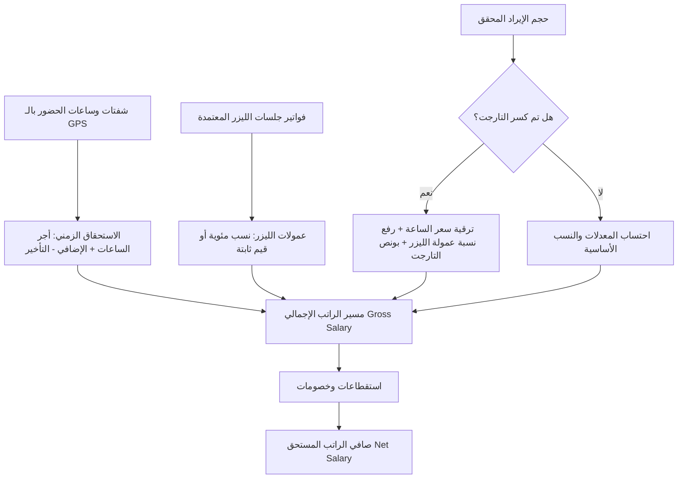
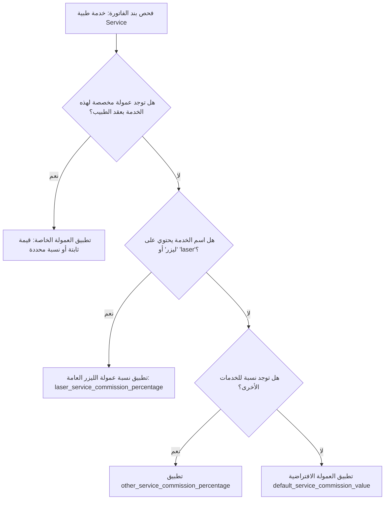
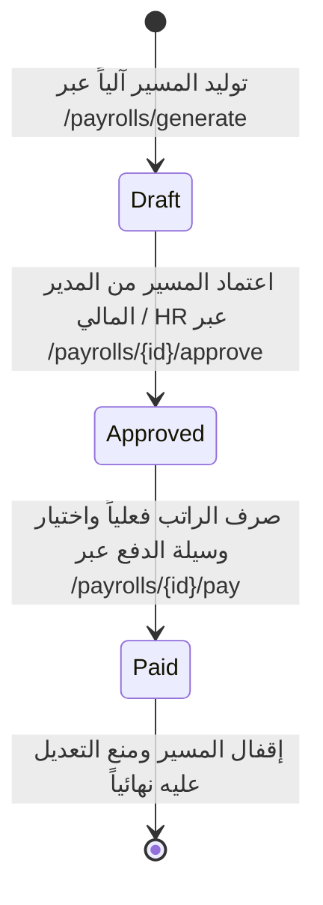

# 📑 تقرير شامل: كيفية احتساب راتب وعمولات طبيب قسم الليزر
### نظام إدارة العيادات والمراكز الطبية (Clinic ERP System)

---

## 📌 1. نظرة عامة (Overview)

في عيادات ومراكز الجلدية والتجميل والليزر، يتبع نظام الموارد البشرية والرواتب (**Modules/HR**) بالتعاون مع موديول الاستقبال والعيادات (**Modules/Reception**) آلية محاسبية مرنة ودقيقة تُعرف بنظام **العقود متعددة الشرائح والعمولات التراكمية (Tiered & Commission-Based Payroll System)**.

لا يعتمد دخل طبيب الليزر على مجرد راتب شهري ثابت، بل يتكون من مزيج ديناميكي يربط بين:
1. **الالتزام بساعات العمل الفعلية** الموثقة جغرافياً بالشفتات والـ GPS.
2. **عمولات جلسات وخدمات الليزر** المحققة من الفواتير الصادرة.
3. **نظام الشرائح الذكية والتارجت (Tiered Target)** الذي يرقي سعر الساعة ونسبة العمولات تلقائياً بمجرد كسر حد مستهدف محدد.



---

## 🧩 2. بنود ومكونات راتب طبيب الليزر في السيستم

ينقسم راتب طبيب الليزر إلى **7 عناصر أساسية** يتم احتسابها بدقة عبر كلاس [`PayrollService`](file:///c:/xampp/htdocs/MyProject/clinic_system/Modules/HR/app/Services/Payroll/PayrollService.php#L174):

### 1️⃣ الراتب الأساسي (`basic_salary`)
* يسجل في ملف المستخدم (`users.basic_salary`).
* **الاحتساب النسبي:** إذا تم استخراج مسير الراتب لفترة جزئية (أقل من 28 يوماً):
  $$\text{الراتب النسبي} = \frac{\text{الراتب الأساسي}}{\text{عدد أيام الشهر}} \times \text{أيام الفترة}$$
* إذا كان الطبيب يعمل بنظام العمولة والساعة فقط بدون أساسي، تكون قيمته `0.00`.

### 2️⃣ أجر ساعات العمل الفعلي (`hourly_pay`)
* يتم سحب الشفتات المسجلة للطبيب من جدول `shifts` ضمن الفترة المحددة.
* يعتمد النظام على الفارق الفعلي بين توقيت فتح وإغلاق الشفت بالدقائق مقسوماً على 60:
  $$\text{إجمالي الساعات} = \sum \left( \frac{\text{Shift End Time} - \text{Shift Start Time}}{60} \right)$$
* يُضرب إجمالي الساعات في سعر الساعة المعتمد بالعقد (`staff_contracts.hourly_rate`):
  $$\text{أجر الساعات} = \text{إجمالي ساعات العمل} \times \text{سعر الساعة}$$

### 3️⃣ الوقت الإضافي المعتمد (`overtime_amount`)
* عند إغلاق الشفت بعد نهاية الدوام الرسمي وتأكيد المدير/الإدارة لاعتماد الإضافي (`shift.overtime_approved = true`):
  $$\text{استحقاق الإضافي} = \text{ساعات الإضافي} \times \text{أجر ساعة الإضافي (overtime\_hour\_rate)}$$

### 4️⃣ استقطاع دقائق التأخير (`late_deduction_amount`)
* يسجل النظام دقائق التأخير عند فتح الشفت بعد الموعد الرسمي (بناءً على موقع الـ GPS وبداية الدوام):
  $$\text{خصم التأخير} = \left( \frac{\text{إجمالي دقائق التأخير}}{60} \right) \times \text{معدل خصم ساعة التأخير (late\_deduction\_rate\_per\_hour)}$$

### 5️⃣ بدل الإجازات الرسمية (`holiday_allowance_amount`)
* عند تكليف الطبيب بالعمل أيام العطلات الرسمية:
  $$\text{بدل الإجازات} = \text{عدد أيام الإجازات} \times \text{بدل اليوم (holiday\_day\_rate)}$$

### 6️⃣ عمولات جلسات وخدمات الليزر (`service_commissions_amount`)
* يمثل الجزء الأكبر والأهم في دخل طبيب الليزر، ويُحسب استناداً إلى فواتير المرضى المكتملة وغير الملغاة (`status != cancelled`).

### 7️⃣ مكافأة وبونص كسر التارجت (`target_bonus_amount`)
* مبلغ مقطوع يُصرف للطبيب عند تحقيق التارجت المالي المحدد في العقد تشجيعاً للأداء المتميز.

---

## 🎯 3. لوجيك وأولويات احتساب عمولة خدمات الليزر (Commission Hierarchy)

يطبق النظام تسلسلاً هرمياً ذكياً لتحديد نسبة أو قيمة العمولة لكل بند في الفاتورة عبر فحص جدول [`staff_contracts`](file:///c:/xampp/htdocs/MyProject/clinic_system/Modules/HR/database/migrations/2026_09_18_230000_create_staff_contracts_table.php#L14) و [`contract_service_commissions`](file:///c:/xampp/htdocs/MyProject/clinic_system/Modules/HR/app/Models/ContractServiceCommission.php#L10):



### ترتيب الأولويات البرمجية بالتفصيل:

1. **الأولوية الأولى (العمولة المخصصة بالاسم - Specific Service Commission):**
   * إذا كان العقد يحتوي على تسعيرة خاصة لخدمة ليزر بعينها في جدول `contract_service_commissions` (مثل: *جلسة ليزر فراكشنال كامل* أو *إزالة تاتو*):
     * إذا كانت ثابتة (`fixed`): $\text{العمولة} = \text{الكمية} \times \text{القيمة الثابتة}$.
     * إذا كانت نسبة (`percentage`): $\text{العمولة} = \text{سعر الخدمة} \times \frac{\text{النسبة}}{100}$.

2. **الأولوية الثانية (نسبة خدمات الليزر العامة - General Laser Percentage):**
   * إذا لم يكن للخدمة بند خاص، يقوم الكود البرمجي بفحص اسم الخدمة عبر التحقق النصي:
     ```php
     $isLaser = str_contains(mb_strtolower($service->name), 'ليزر') 
             || str_contains(strtolower($service->name), 'laser');
     ```
   * إذا كانت الخدمة جلسة ليزر، يتم تطبيق النسبة المئوية المخصصة لليزر في العقد (`laser_service_commission_percentage`):
     $$\text{عمولة البند} = \text{إجمالي سعر الخدمة في الفاتورة} \times \left( \frac{\text{laser\_service\_commission\_percentage}}{100} \right)$$

3. **الأولوية الثالثة (نسبة الخدمات الأخرى - Other Services Percentage):**
   * إذا كانت الخدمة كشفاً جلدياً، أو جلسة تقشير، أو بلازما (ليست ليزر):
     $$\text{العمولة} = \text{إجمالي سعر الخدمة} \times \left( \frac{\text{other\_service\_commission\_percentage}}{100} \right)$$

4. **الأولوية الرابعة (النسبة/القيمة الافتراضية - Default Commission):**
   * في حال عدم توفر أي مما سبق، يُطبق الحقل الافتراضي بالعقد (`default_service_commission_value`).

---

## 🚀 4. نظام التارجت والترقية للشريحة الأعلى (Generic Tiered Target)

يحتوي النظام على ميزة متطورة لتشجيع أطباء الليزر على زيادة الإنتاجية:

### أ. نوع التارجت (`target_type`)
يدعم النظام خيارين لقياس التارجت شهرياً:
1. **دخل واستحقاق الطبيب (`doctor_income`):** يُقاس التارجت بمجموع (أجر الساعات + عمولات الخدمات) التي حققها الطبيب.
2. **إجمالي إيراد المركز المحقق (`clinic_revenue`):** يُقاس التارجت بإجمالي مبالغ الفواتير الناتجة عن الطبيب للمركز.

### ب. ماذا يحدث برمجياً فور كسر التارجت؟
إذا تجاوزت القيمة المحققة حد التارجت (`benchmarkValue >= target_amount`):
1. **ترقية أجر الساعة فوراً:** يعاد احتساب ساعات العمل بالكامل بسعر الساعة الترقوي (`target_achieved_hourly_rate`).
   * *مثال:* ترتفع الساعة من 40 جنيهاً إلى 80 جنيهاً عن الشهر كاملاً.
2. **ترقية نسبة عمولة الليزر بأثر رجعي للفترة:**
   * يعاد احتساب جميع جلسات الليزر التي قام بها الطبيب خلال الفترة بالنسبة الترقوية الأعلى (`target_achieved_laser_percentage`).
   * *مثال:* ترتفع نسبة الليزر من 10% إلى 15% على جميع الفواتير.
3. **ترقية نسبة الخدمات الأخرى:** تطبيق `target_achieved_other_percentage` (مثلاً من 15% إلى 20%).
4. **صرف مكافأة كسر التارجت:** إضافة مبلغ المكافأة (`target_bonus`) تلقائياً كبند استحقاق إضافي.
5. **تحديث ملف الطبيب:** تعديل حالة `achieved_target = true` في جدول المستخدمين.

---

## 🧮 5. المعادلات الرياضية لاحتساب الراتب

$$\begin{aligned}
\text{Gross Salary} &= \text{Basic Salary} \\
&+ (\text{Total Working Hours} \times \text{Hourly Rate}) \\
&+ (\text{Overtime Hours} \times \text{Overtime Rate}) \\
&+ (\text{Holiday Days} \times \text{Holiday Rate}) \\
&+ \sum (\text{Laser Commissions}) + \sum (\text{Other Service Commissions}) \\
&+ \text{Target Bonus} \\
&+ \text{Other Allowances}
\end{aligned}$$

$$\begin{aligned}
\text{Total Deductions} &= \left( \frac{\text{Late Minutes}}{60} \times \text{Late Rate} \right) + \text{Manual Deductions}
\end{aligned}$$

$$\text{Net Salary} = \max(0, \text{Gross Salary} - \text{Total Deductions})$$

---

## 💼 6. مثال عملي رقمي واقعي (Practical Scenario)

لنفترض وجود طبيبة بقسم الليزر: **د. نورهان (أخصائية جلدية وتجميل وليزر)**:

### 📋 بيانات العقد (`staff_contracts`):
* **الراتب الأساسي:** 3,000 ج.
* **سعر الساعة العادي:** 50 ج/ساعة.
* **سعر ساعة الإضافي:** 70 ج/ساعة.
* **معدل خصم التأخير:** 50 ج/ساعة تأخير.
* **نسبة عمولة الليزر الأساسية:** 10%.
* **نسبة عمولة الخدمات الأخرى:** 15%.
* **التارجت الشهري (`target_amount`):** 50,000 ج من إيراد المركز (`clinic_revenue`).
* **المزايا عند تحقيق التارجت:**
  * يرتفع سعر الساعة إلى: 80 ج/ساعة.
  * ترتفع نسبة عمولة الليزر إلى: 15%.
  * ترتفع نسبة الخدمات الأخرى إلى: 20%.
  * مكافأة كسر التارجت (`target_bonus`): 1,500 ج.

---

### 📊 أداء الطبيبة خلال الشهر:
* **ساعات العمل الفعلية المسجلة بالشفتات:** 120 ساعة.
* **ساعات الإضافي المعتمدة:** 10 ساعات.
* **دقائق التأخير:** 60 دقيقة (ساعة واحدة).
* **الفواتير المنفذة:**
  * جلسات ليزر (جسم كامل، بكيني، وجه): إجمالي مبيعات **45,000 ج**.
  * خدمات جلدية أخرى (تقشير، بوتوكس، فراكشنال): إجمالي مبيعات **15,000 ج**.
  * **إجمالي إيراد المركز المحقق من الطبيبة:** $45,000 + 15,000 = \mathbf{60,000\text{ ج}}$.

---

### 🔍 خطوات الحساب الآلي في السيستم:

#### 1. التحقق من التارجت:
* إيراد المركز المحقق ($60,000\text{ ج}$) > حد التارجت ($50,000\text{ ج}$).
* **النتيجة:** تم كسر التارجت بنجاح وتفعيل الشريحة الترقوية الأعلى!

#### 2. احتساب ساعات العمل والإضافي والتأخير (بعد الترقية):
* أجر الساعات الترقوي: $120\text{ ساعة} \times 80\text{ ج} = \mathbf{9,600\text{ ج}}$ *(بدلاً من 6,000 ج)*.
* استحقاق الإضافي: $10\text{ ساعات} \times 70\text{ ج} = \mathbf{700\text{ ج}}$.
* خصم التأخير: $1\text{ ساعة تأخير} \times 50\text{ ج} = \mathbf{-50\text{ ج}}$.

#### 3. احتساب عمولات الليزر والخدمات (بعد الترقية إلى 15% و 20%):
* عمولة جلسات الليزر: $45,000\text{ ج} \times 15\% = \mathbf{6,750\text{ ج}}$ *(بدلاً من 4,500 ج)*.
* عمولة الخدمات الأخرى: $15,000\text{ ج} \times 20\% = \mathbf{3,000\text{ ج}}$ *(بدلاً من 2,250 ج)*.
* **إجمالي العمولات:** $6,750 + 3,000 = \mathbf{9,750\text{ ج}}$.

#### 4. مكافأة كسر التارجت:
* بونص إضافي ناتج عن الترقية = $\mathbf{1,500\text{ ج}}$.

#### 5. تجميع مفردات الراتب في جدول مسير الراتب (`Payroll Items`):

| البند | النوع | المعادلة / التفاصيل | المبلغ المستحق |
| :--- | :---: | :--- | :---: |
| الراتب الأساسي | إضافة | أساسي العقد الشهري | + 3,000.00 ج |
| أجر ساعات العمل | إضافة | 120 ساعة × 80 ج (الشريحة الترقوية بعد التارجت) | + 9,600.00 ج |
| إضافي ساعات العمل | إضافة | 10 ساعات × 70 ج | + 700.00 ج |
| عمولات جلسات الليزر | إضافة | 15% من مبيعات ليزر بقيمة 45,000 ج | + 6,750.00 ج |
| عمولات الخدمات الأخرى | إضافة | 20% من مبيعات خدمات بقيمة 15,000 ج | + 3,000.00 ج |
| مكافأة كسر التارجت | إضافة | بونص تحقيق تارجت مبيعات 60,000 من أصل 50,000 ج | + 1,500.00 ج |
| **إجمالي الراتب (Gross Salary)** | **إجمالي** | **مجموع كافة الاستحقاقات** | **24,550.00 ج** |
| خصم التأخير | استقطاع | 60 دقيقة تأخير بمعدل 50 ج/ساعة | - 50.00 ج |
| **صافي الراتب المستحق (Net Salary)**| **الصافي** | **الإجمالي - الخصومات** | **24,500.00 ج** |

---

## 🗄️ 7. هيكلية الجداول وقاعدة البيانات المرتبطة بحساب الراتب

| اسم الجدول | الحقول الجوهرية لحساب راتب طبيب الليزر | الغرض البرمجي |
| :--- | :--- | :--- |
| `staff_contracts` | `hourly_rate`, `laser_service_commission_percentage`, `has_target`, `target_amount`, `target_type`, `target_achieved_hourly_rate`, `target_achieved_laser_percentage`, `target_bonus` | حفظ شروط تعاقد الطبيب والنسب الشرائحية والتارجت |
| `contract_service_commissions` | `contract_id`, `service_id`, `commission_type`, `commission_value` | تحديد استثناءات وعمولات خاصة لجلسات ليزر معينة |
| `shifts` | `user_id`, `start_time`, `end_time`, `is_late`, `late_minutes`, `overtime_approved`, `overtime_minutes` | مراقبة الحضور والانصراف بالـ GPS وحساب ساعات العمل الفعلية |
| `invoices` & `invoice_items` | `doctor_id`, `grand_total`, `item_type`, `service_id`, `quantity`, `total_price` | تجميع جلسات الليزر المنفذة وقيمها لاستخراج العمولات |
| `payrolls` | `basic_salary`, `hourly_pay`, `service_commissions_amount`, `target_achieved`, `target_bonus_amount`, `gross_salary`, `net_salary`, `status` | سجل مسير الراتب الإجمالي للطبيب عن الشهر المحدد |
| `payroll_items` | `payroll_id`, `type`, `description`, `amount`, `is_addition`, `reference_id` | السجل التفصيلي لكل بند (ساعات، كل فاتورة ليزر، إضافي، خصم) |

---

## 🔄 8. دورة حياة صرف الراتب (Payroll Lifecycle)



1. **التوليد المبدئي (Draft):**
   * يتم استدعاء `POST /api/v1/payrolls/generate` وتحديد `user_id` والشهر أو الفترة (`start_date` & `end_date`).
   * يقوم النظام بعمل مسح شامل للشفتات، الفواتير، وحساب كسر التارجت من عدمه، وإنشاء بنود `payroll_items`.
2. **التعديل اليدوي إن وُجد (Update):**
   * يمكن لمدير الموارد البشرية إضافة مكافآت يدوية استثنائية (`other_allowances`) أو استقطاعات خاصة (`deductions`).
3. **الاعتماد (Approved):**
   * يتم استدعاء `POST /api/v1/payrolls/{id}/approve` ليتم توثيق هوية المعتمد (`approved_by`) وتاريخ الاعتماد (`approved_at`).
4. **التأكيد والصرف (Paid):**
   * استدعاء `POST /api/v1/payrolls/{id}/pay` وتحديد وسيلة السداد (خزينة كاش `cash` أو تحويل بنكي `bank_transfer`)، ويصبح المسير غير قابل للحذف أو التكرار منعاً للتلاعب المحاسبي.
