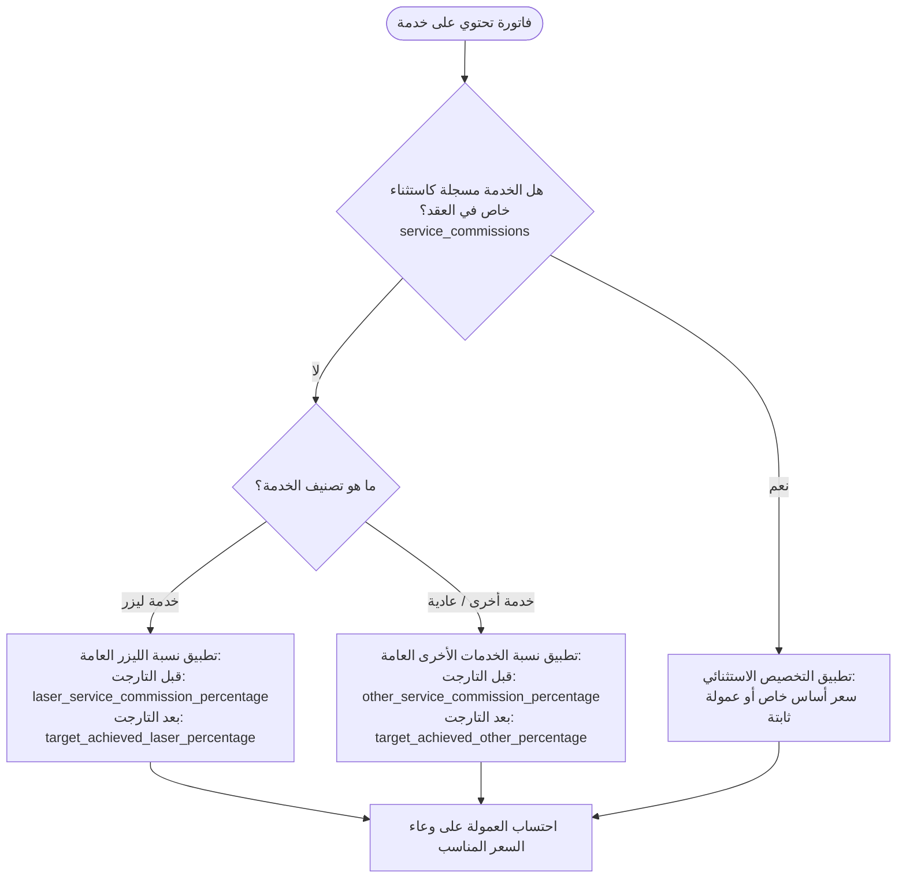

# خطة معمارية شاملة: تطوير نظام عقود الأطباء وعمولات الخدمات والأجهزة (`plan.md`)

## 1. ملخص المشكلات الحالية (Problem Statement)

### المشكلة الأولى: إرهاق إدخال مئات الخدمات يدوياً في العقد (The 200 Services Burden)
* **الوضع الحالي**: في [PayrollService.php](file:///c:/xampp/htdocs/MyProject/clinic_system/Modules/HR/app/Services/Payroll/PayrollService.php)، إذا لم تكن الخدمة مسجلة صراحة في جدول `contract_service_commissions` التابع للعقد، يتم اعتبارها خدمة خارج العقد (`uncontracted_service`) وتُحسب عمولتها **0 ج**.
* **النتيجة الكارثية**: إذا كانت العيادة تقدم 200 خدمة (منها 10 ليزر و 190 خدمات جلدية/تجميل عادية)، تضطر الإدارة إلى إدخال الـ 190 خدمة يدوياً في عقد كل طبيب وتحديد نسبة 10% لكل خدمة واحدة تلو الأخرى، وهو أمر مرهق جداً ومعرّض للخطأ.
* **المفارقة البرمجية**: جدول `staff_contracts` يحتوي بالفعل على حقول مجهزة وغير مفعلة بالكامل في مسير الرواتب:
  - `laser_service_commission_percentage` (نسبة الليزر الأساسية قبل التارجت)
  - `other_service_commission_percentage` (نسبة باقي الخدمات الأساسية قبل التارجت)
  - `target_achieved_laser_percentage` (نسبة الليزر بعد كسر التارجت)
  - `target_achieved_other_percentage` (نسبة باقي الخدمات بعد كسر التارجت)

---

### المشكلة الثانية: جلسات الأجهزة المرتبطة بمستلزمات متغيرة (Device Sessions with Dynamic Consumables)
* **مثال واقعي**: جلسة "جهاز فراكشنال" سعر تشغيل الجهاز الأساسي 500 ج، لكن في كل جلسة يستهلك الطبيب مستلزمات طبية متغيرة حسب حالة المريض (`service_items_ids`: اكسسوزوم، ياقوت، تيبس، إلخ).
* **الفاتورة الفعلية**: المريض يدفع: سعر الجهاز (500 ج) + المستلزمات (مثلاً 3,700 ج) = **4,200 ج**.
* **الخلل الحالي**:
  1. في العقد، لا يمكن للإدارة التنبؤ بالمستلزمات التي ستُستخدم مع كل مريض مسبقاً (`service_items_ids` قد تكون لا حصر لها).
  2. إذا حُدد سعر أساس للخدمة في العقد بـ 500 ج (`doctor_service_price = 500`)، يُحسب للطبيب 15% من الـ 500 ج فقط (75 ج)، بينما المريض دفع 4,200 ج.
  3. وإذا لم تُحدد الخدمة في العقد، تُعامل كخدمة خارج العقد بعمولة 0 ج!

---

## 2. الحل المعماري للمشكلة الأولى: نظام القواعد المتتالية (Cascading Commission Hierarchy)

بدلاً من إدخال 200 خدمة لكل طبيب، يتم اعتماد هرم متسلسل لاحتساب العمولة من 3 مستويات:



### كيف يعمل هذا النظام في عقد الطبيب؟
عند إنشاء العقد، يكتفي مدير النظام بإرسال:
```json
{
    "user_id": 90,
    "title": "عقد أخصائي جلدية وتجميل وليزر",
    "laser_service_commission_percentage": 10.00,
    "other_service_commission_percentage": 10.00,
    "has_target": true,
    "target_amount": 7500.00,
    "target_achieved_laser_percentage": 15.00,
    "target_achieved_other_percentage": 15.00,
    "service_commissions": [] 
}
```
* **النتيجة**:
  - جميع خدمات الليزر (الـ 10 خدمات) تأخذ تلقائياً 10% (وتترقى إلى 15% بعد التارجت).
  - جميع الخدمات الأخرى (الـ 190 خدمة) تأخذ تلقائياً 10% (وتترقى إلى 15% بعد التارجت).
  - **مصفوفة `service_commissions` تظل فارغة تماماً**، ولا نضع فيها إلا خدمة واحدة أو اثنتين إذا كان لهما وضع شاذ عن القاعدة (مثلاً: كشف استشاري بقيمة ثابتة 100 ج)!

---

## 3. الحل المعماري للمشكلة الثانية: احتساب وعاء سعر الخدمة والأجهزة (Dynamic Commission Base)

لحل مشكلة جهاز الفراكشنال والمستلزمات المتغيرة، هناك 3 سياسات محاسبية مرنة يمكن تطبيقها:

### الخيار (أ) - الحل التلقائي الموصى به (Dynamic Invoice Price Base)
* **القاعدة البرمجية**:
  1. إذا حُدد في العقد لخدمة معينة سعر أساس صريح (`doctor_service_price > 0`):
     - يُعتمد هذا السعر كأساس لحساب نسبة الطبيب ($Base = doctor\_service\_price$).
  2. إذا لم يُحدد سعر أساس صريح (أي `doctor_service_price == 0` أو الخدمة لم تُدرج أصلاً وتخضع للنسبة العامة):
     - **يُعتمد سعر الفاتورة الفعلي الإجمالي للبند (`item->total_price`) كأساس للحساب**!
* **التطبيق على مثال الفراكشنال**:
  - جلسة الفراكشنال دخل فيها مستلزمات بقيمة 3,700 ج + جهاز 500 ج = 4,200 ج.
  - الخدمة غير مقيدة بسعر أساس 500 ج، فتخضع للنسبة العامة (15% من إجمالي الفاتورة 4,200 ج) = **630 ج عمولة للطبيب**.
  - لا حاجة لتسجيل أي `service_items_ids` داخل العقد، فالسيستم يتفاعل ديناميكياً مع ما استخدمه المريض فعلياً.

---

### الخيار (ب) - خيار وعاء العمولة المخصص بالعقد (Commission Base Mode Setting)
إضافة حقل جديد في جدول `staff_contracts`:
`commission_base_mode`: `[total_price, service_base_price, net_revenue]`
* `total_price`: النسبة على كامل ما دفعه المريض في الفاتورة (شامل الجهاز والمواد).
* `service_base_price`: النسبة على سعر الخدمة الأساسي فقط (500 ج)، وتُستبعد أسعار المواد المخزنية.
* `net_revenue`: النسبة على (سعر الفاتورة - تكلفة شراء المواد من المخزن) لمشاركة الأرباح الصافية فقط.

---

## 4. خطة التعديل البرمجي التفصيلية (Step-by-Step Implementation Plan)

### الخطوة 1: تعديل [PayrollService.php](file:///c:/xampp/htdocs/MyProject/clinic_system/Modules/HR/app/Services/Payroll/PayrollService.php)
1. **تحديث دالة استخراج النسبة وسعر الأساس لكل بند فاتورة**:
   - البحث أولاً عن الخدمة في `contract->serviceCommissions`.
   - في حال عدم وجودها:
     * فحص هل الخدمة "ليزر" (عبر فحص نوع الخدمة أو اسمها).
     * تطبيق `laser_service_commission_percentage` (أو `target_achieved_laser_percentage` إذا كسر التارجت).
     * إذا لم تكن ليزر: تطبيق `other_service_commission_percentage` (أو `target_achieved_other_percentage`).
   - تحديد وعاء السعر:
     * إذا كانت الخدمة مسجلة بسعر أساس (`doctor_service_price > 0`)، يتم الاعتماد عليه.
     * إذا كان `doctor_service_price == 0` أو الخدمة عامة، يتم اعتماد `$item->total_price`.
2. **إلغاء وسم الخدمات بـ `uncontracted_service`** طالما أن العقد يحتوي على نسبة عامة لليزر أو لباقي الخدمات (`laser_service_commission_percentage > 0` أو `other_service_commission_percentage > 0`).

---

### الخطوة 2: تحديث فحص الليزر تلقائياً (Service Laser Detection)
* دعم فحص الليزر بشكل تلقائي ومرن:
  1. هل الخدمة معلّمة في جدول `service_commissions` بـ `is_laser = true`؟
  2. أو هل اسم الخدمة يحتوي على كلمة `ليزر` أو `laser`؟
  3. أو (اختيارياً) إضافة عمود `is_laser` إلى جدول الخدمات `services` لتحديدها مرة واحدة على مستوى النظام.

---

### الخطوة 3: التوافق الكامل مع نظام التارجت المتصاعد (Progressive Target)
* عند كسر التارجت أثناء الشهر، يتم الترقية بسلاسة:
  - خدمات الليزر تنتقل من `laser_service_commission_percentage` إلى `target_achieved_laser_percentage`.
  - باقي الخدمات تنتقل من `other_service_commission_percentage` إلى `target_achieved_other_percentage`.
  - وتُحسب الفاتورة التي كُسر فيها التارجت مجزأة (قبل وبعد) بنفس الدقة المحاسبية المعتمدة.

---

## 5. مقارنة قبل وبعد التطبيق (Before vs After)

| وجه المقارنة | النظام الحالي | بعد تطبيق الخطة المقترحة |
| :--- | :--- | :--- |
| **إدخال 200 خدمة في العقد** | إدخال الـ 200 خدمة واحدة تلو الأخرى يدوياً | إدخال نسبتين عامتين فقط (ليزر 10%، باقي الخدمات 10%) |
| **استثناءات الخدمات** | كل خدمة تعامل كاستثناء إجباري | تسجل في `service_commissions` فقط الخدمات الشاذة عن القاعدة |
| **خدمة الفراكشنال والمستلزمات** | تحسب النسبة فقط على سعر الأساس (500 ج) وتتجاهل المستلزمات | تحسب ديناميكياً على إجمالي الفاتورة المدفوع (4,200 ج) أو بمرونة حسب السياسة |
| **تغيير المستلزمات الطبية** | مستحيل التنبؤ بها في العقد | تحسب تلقائياً حسب ما تم صرفه فعلياً في الفاتورة |
| **صيانة العقود وتعديلها** | تعديل 200 سطر لكل طبيب | تعديل رقمين فقط في واجهة العقد |
