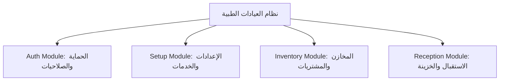
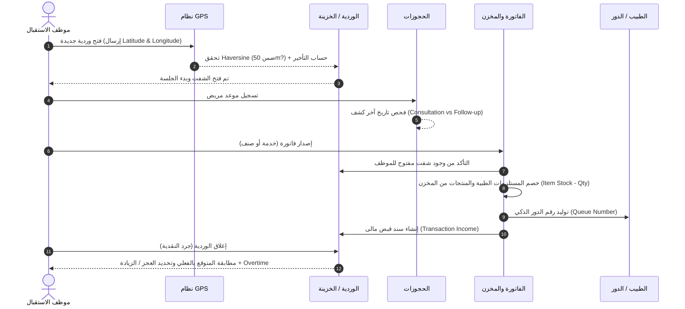

# 🏥 تقرير منطق العمل ودورة التشغيل الكاملة لنظام العيادات (Clinic ERP System)

---

## 📌 1. نظرة عامة ومعمارية النظام (System Architecture)

تم بناء النظام باستخدام إطار عمل **Laravel 11** بأسلوب **Modular Monolith** عبر حزمة `nwidart/laravel-modules`.  
يهدف النظام إلى إدارة كافة العمليات الإدارية، الطبية، المالية، والمخزنية داخل المراكز والعيادات الطبية بشكل آلي ومتكامل يضمن دقة الحسابات، ضبط المخزون، وتفادي الأخطاء البشرية.

---

## 🧩 2. الموديولات الرئيسية في النظام (Core Modules)

### 1️⃣ موديول الحماية والمستخدمين (`Modules/Auth`)
* **إدارة طاقم العمل (Staff Management):** تسكير بيانات الأطباء، موظفي الاستقبال، والتمريض.
* **الأدوار والصلاحيات (Roles & Permissions):** يعتمد على `Spatie/laravel-permission` لتحديد صلاحيات دقيقة لكل شاشة وإجراء.
* **مصادقة الواجهات (JWT API Authentication):** تأمين API وتوليد رموز التوكن مع تتبع بيانات المستخدم المسجل بكل حركة (`created_by`).

---

### 2️⃣ موديول التهيئة والإعدادات (`Modules/Setup`)
* **الأقسام والعيادات (`Departments`):** تقسيم المركز الطبي إلى تخصصات (أسنان، جلدية، باطنة...).
* **الخدمات الطبية (`Services`):** تعريف الكشوفات، العمليات، والملاحظات مع تحديد سعر كل خدمة.
* **ربط الخدمات بالمستلزمات (`ServiceItems`):** ربط الخدمة الطبية بالمواد والمستلزمات المستهلكة من المخزن (BOM - Bill of Materials).
* **إعدادات النظام (`Settings`):** 
  * إحداثيات موقع العيادة والمدى المسموح للحضور بالـ GPS.
  * نسبة خصم الموظفين (`staff_discount_percentage`).
  * الحد الأقصى لأيام المتابعة المجانية/الاستشارة (`follow_up_max_days`).

---

### 3️⃣ موديول المخازن والمشتريات (`Modules/Inventory`)
* **إدارة الموردين (`Suppliers`):** تسجيل وتتبع بيانات الموردين.
* **الأصناف والمستلزمات (`Items`):** تسجيل الأصناف الطبية والأدوية مع دعم أسعار الشراء والبيع وحد إعادة الطلب.
* **معامل التحويل (Unit Conversion Factor):** التحويل التلقائي بين وحدة الشراء (مثلاً: كرتونة/عبوة) ووحدة الاستهلاك الصغرى (مثلاً: مل/قطعة).
* **فواتير المشتريات (`PurchaseInvoices`):** إضافة الشحنات وتحديث رصيد المخزن تلقائياً مع خيار العكس التلقائي عند الحذف.

---

### 4️⃣ موديول الاستقبال والخزينة والمالية (`Modules/Reception`)
* **سجل المرضى (`Patients`):** إدارة بيانات المرضى وملاحظاتهم وهل المريض من موظفي المركز (`is_staff`).
* **إدارة الورديات (`Shifts`):** فتح وإغلاق الشفت، التسجيل الجغرافي بالـ GPS، وحساب العجز والزيادة والوقت الإضافي.
* **إدارة المواعيد (`Appointments`):** حجز الكشوفات، وتحديد نوع الزيارة تلقائياً (كشف/متابعة).
* **الفواتير والتحصيل (`Invoices`):** إصدار الفواتير للخدمات أو المنتجات المباشرة، توليد رقم الدور، وخصم المخزون.
* **السندات المالية (`Transactions`):** تسجيل حركات الخزينة (مقابوضات `income` / مرتجعات `refund`).

---

## 🔄 3. دورة العمل التشغيلية الكاملة (Complete Operational Workflow)

---

## 💡 4. تفاصيل اللوجيك وقواعد العمل البرمجية (Core Business Logic)

### 📌 أ. لوجيك فتح الوردية والحضور الجغرافي (GPS Shift Opening)
1. **منع الشفتات المتعددة:** لا يمكن للمستخدم فتح أكثر من وردية مفتوحة في نفس الوقت.
2. **التحقق من موقع العيادة (Haversine Formula):**
   $$d = 2 R \cdot \arcsin \left( \sqrt{ \sin^2\left(\frac{\Delta \phi}{2}\right) + \cos(\phi_1) \cos(\phi_2) \sin^2\left(\frac{\Delta \lambda}{2}\right) } \right)$$
   يقوم النظام بحساب المسافة الفعلية بين إحداثيات جهاز الموظف وإحداثيات العيادة المخزنة في جدول `settings`. إذا تجاوزت المسافة المدى المسموح (`clinic_radius_meters`) يتم رفض فتح الوردية.
3. **احتساب التأخير:** يتم مقارنة وقت الفتح بوقت بداية العمل الرسمي (8:00 AM) واحتساب دقائق التأخير (`late_minutes`).

---

### 📌 ب. لوجيك التحديد التلقائي لنوع الزيارة (Consultation vs Follow-up)
عند تسجيل حجز جديد بدون تحديد نوع الزيارة:
1. يتم الفحص في جدول `appointments` عن آخر حجز مكتمل لنفس المريض مع نفس الطبيب.
2. إذا كان الفارق بين تاريخ اليوم وتاريخ آخر موعد أقل من أو يساوي قيمة `follow_up_max_days` (الافتراضي 30 يوم):
   * يتم تحديد نوع الزيارة تلقائياً كـ **متابعة (`follow_up`)**.
3. إذا تجاوز هذه المدة أو لم يوجد حجز سابق:
   * يتم تحديد الزيارة كـ **كشف جديد (`consultation`)**.

---

### 📌 ج. لوجيك إصدار الفواتير والخصم التلقائي للمخزون (Invoicing & Auto Stock)
1. **ربط الشفت:** تشترط العملية وجود شفت مفتوح للكاشير/الموظف الحالي.
2. **التعامل الذكي مع الحضور الفوري (Walk-in):**
   * إذا كانت الفاتورة لكشف/خدمة ولا يوجد حجز مسبق، يقوم النظام بإنشاء حجز فوري واكتشافه تلقائياً وتحديث حالته فوراً إلى مكتمل (`completed`).
3. **توليد رقم الدور ورقم الفاتورة:**
   * رقم الفاتورة بتسلسل سنوي محمي ضد التزامن (`lockForUpdate`): `INV-2026-000001`.
   * رقم الدور (`queue_number`) يتولد تسلسلياً للطبيب المحدد خلال الشفت الحالي فقط.
4. **الخصم المزدوج للمخزون:**
   * **إذا كان البند مبيعات منتج (`product`):** يُخصم عدد القطع مباشرة من المخزن.
   * **إذا كان البند خدمة طبية (`service`):** يجلب النظام قائمة المستلزمات الطبية للخدمة (`service_items`) ويخصم القيمة المطلوبة مضروبة في عدد الخدمات من أرصدة المخزن.
   * **الحماية من نفاذ المخزون:** إذا كانت الكمية المتوفرة لأي خامة غير كافية، يتم التراجع عن المعاملة بالكامل (`DB Transaction Rollback`) وإظهار رسالة خطأ موضحة لاسم الصنف الناقص.
5. **الخصومات التلقائية:**
   * إذا كان المريض موظفاً بالمركز (`patient.is_staff = true`)، يُطبق خصم الموظفين المحدد بالنظام تلقائياً.
6. **سندات الخزينة:**
   * يتم إنشاء حركة `income` بقيمة الصافي (`grand_total`) وتربط برقم الشفت ورقم الفاتورة.

---

### 📌 د. لوجيك مرتجعات الفواتير (Refund Logic)
* دعم **المرتجع الكلي** أو **المرتجع الجزئي** على مستوى البنود.
* **إعادة المخزون:** عند المرتجع، يتم إعادة كميات المنتجات والمستلزمات الطبية المرتبطة بالخدمات تلقائياً إلى رصيد المخزن (`increment current_stock`).
* **إلغاء الحجز:** عند استرداد الفاتورة المرتبطة بحجز كلياً، تتغير حالة الحجز تلقائياً إلى ملغى (`cancelled`).
* **سند المرتجع:** يتم تسجيل حركة خروج نقدية `refund` في الشفت المفتوح للمستخدم لحساب التسوية المالية بدقة.

---

### 📌 هـ. لوجيك إغلاق الوردية والتسوية المالية (Shift Closure & Reconciliation)
عند إغلاق الشفت، يُدخل الموظف المبلغ النقدي الموجود في الدرج (`final_balance`):
1. **حساب الرصيد المتوقع (Expected Balance):**
   $$\text{الرصيد المتوقع} = \text{الرصيد الافتتاحي} + \text{إجمالي المقبوضات الكاش} - \text{إجمالي المرتجعات الكاش}$$
2. **احتساب الفارق (Difference):**
   $$\text{الفارق} = \text{الرصيد الفعلي} - \text{الرصيد المتوقع}$$
   * إذا كان الناتج `0`: الدرج مضبوط تماماً.
   * إذا كان الناتج موجباً: يوجد **زيادة** في الخزينة.
   * إذا كان الناتج سلباً: يوجد **عجز** في الخزينة.
3. **احتساب الساعات الإضافية (Overtime):** مقارنة وقت الإغلاق بوقت انتهاء الشفت الرسمي (4:00 PM) واحتساب دقائق الإضافي (`overtime_minutes`).

---

## 🛠️ 5. ملخص الجداول الرئيسية والعلاقات (Database Schema Matrix)

| اسم الجدول | الموديول | الوظيفة الرئيسية | العلاقات المرتبطة |
| :--- | :--- | :--- | :--- |
| `users` | Auth | بيانات الموظفين، الأطباء، موظفي الاستقبال | `roles`, `permissions` |
| `departments` | Setup | الأقسام والعيادات الطبية | `services` |
| `services` | Setup | قائمة الخدمات الطبية وأسعارها | `departments`, `service_items` |
| `service_items` | Setup | جدول وسيط لربط الخدمة بالمواد المستهلكة | `services`, `items` |
| `suppliers` | Inventory | بيانات الموردين | `purchase_invoices` |
| `items` | Inventory | المخزون والأصناف والمستلزمات الطبية | `purchase_invoice_items`, `service_items` |
| `purchase_invoices`| Inventory | فواتير المشتريات وحركات التوريد | `suppliers`, `purchase_invoice_items` |
| `patients` | Reception | بيانات المرضى والتاريخ الطبي | `appointments`, `invoices` |
| `shifts` | Reception | الورديات، الحضور بالـ GPS والخزينة | `users`, `invoices`, `transactions` |
| `appointments` | Reception | مواعيد المرضى وحالات الكشف | `patients`, `users(doctor)`, `services` |
| `invoices` | Reception | فواتير المبيعات للخدمات والمنتجات | `patients`, `users(doctor/nurse)`, `shifts`, `invoice_items` |
| `transactions` | Reception | السندات والحركات المالية المقبوضة/المستردة | `invoices`, `shifts` |

---

## 🔥 6. النقاط القوية والمميزات الفنية للسيستم (Key Strengths)

1. **الوقاية من Race Conditions:** استخدام `lockForUpdate()` في توليد الأرقام التسلسلية للفواتير والدور لتفادي تكرار الأرقام في حالات التزامن العالي.
2. **إدارة المخزون الذكية (BOM Level):** الخصم التلقائي لمستلزمات الخدمات (مثل مستلزمات حشو الأسنان، التعقيم، إلخ) بمجرد قطع الفاتورة.
3. **حماية الخزينة والـ GPS:** منع المعاملات المالية بدون شفت مفتوح والتأكد من تواجد الموظف داخل النطاق الجغرافي للعيادة.
4. **التكامل بين المواعيد والفواتير:** التعرف التلقائي على الزيارات الفورية وتتبع نوع الزيارة (كشف/متابعة) بناءً على إعدادات السيستم.
